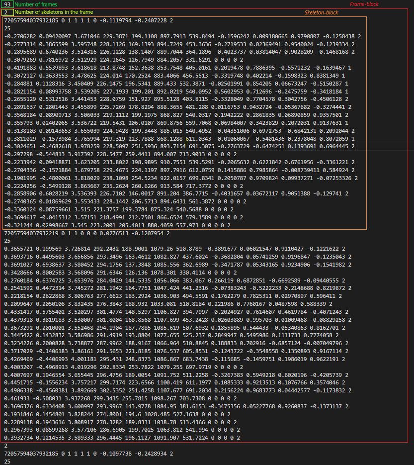
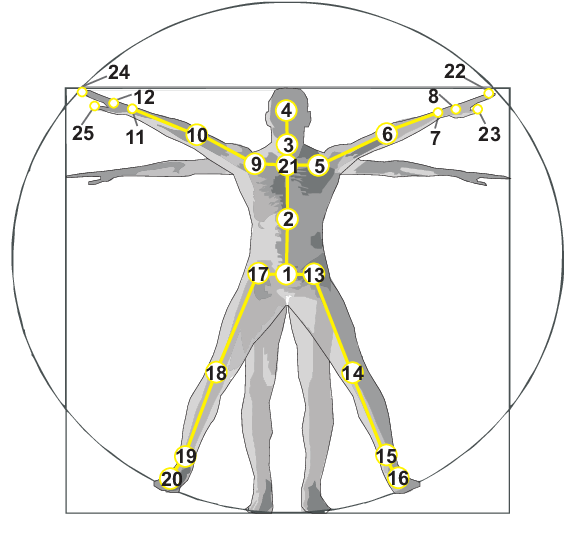

# **Human Action Recognition in Videos using Pedestrian Keypoints**
*Case study in Artificial Intelligence and Visual Computing as part of a [group school project](https://moodle.polytechnique.fr/course/view.php?id=13078) with [IDEMIA](https://www.idemia.com/)*.

___
___

- [**Introduction**](#introduction)
- [**The Dataset**](#the-dataset)
    - [*Presentation*](#presentation)
    - [*Structure*](#structure)
    - [*Content*](#content)
    - [*Skeletons*](#skeletons)
    - [*Action Classes*](#action-classes)
- [**Analysis and Visualization of the Dataset**](#analysis-and-visualization-of-the-dataset)
- [**Models**](#models)
- [**Resuts**](#results)
- [**Conclusion**](#conclusion)
- [**References**](#references)

___

## **Introduction**

Classifying pedestrians' every-day life actions is an interesting topic in computer vision, including a lot of sub-topics like pedestrian detection and segmentation, video consolidation, classification, etc.

To recognize an action, a human being would localize the person first, analyze the position of its body-parts, see how these are moving and interacting, and classify accordingly.

We propose here to reproduce this process, using the information of body-parts position (pedestrian keypoints/skeleton).
The data to process is a sequence of labelled 3D coordinates on pedestrians, and the output is the label of the current action (walking, running, biking, falling on the ground, fighting, etc.).

___

## **The Dataset**

### ***Presentation***

The dataset used is the ***NTU RGB+D - Action Recognition Dataset*** (***Skeletons***) described in [this repository](https://github.com/shahroudy/NTURGB-D).

When cloning the current respository please also download the following [zip file](https://drive.google.com/file/d/1U1veKcEC2B5Xn_o3StN3U8qNFHRhxqLu/view?usp=sharing) (5.8 Go zipped and 13,4 Go unzipped), and extract it in the folder named *data* at the root of the repository. This compressed folder contains the relevant data for our project. Once it is done, run ```data_cleaning.py``` to format the data correctly.

### ***Structure***

The *NTU RGB+D skeletons dataset* contains 56,880 skeletal data samples (3D locations of 25 major body joints at each frame).

302 samples have missing or incomplete skeleton data. The list of these are provided [here](./data/missing_skeletons.txt).

Each file in the dataset is in the format of SsssCcccPpppRrrrAaaa (e.g., S001C002P003R002A013), in which:
- sss is the setup number (between 001 and 017);
- ccc is the camera ID;
- ppp is the performer (or subject) ID;
- rrr is the replication number (1 or 2);
- aaa is the action class label (between 001 and 060).

To know more about the camera IDs and more details about the setup, please refer to the [NTU RGB+D dataset paper](http://www.cv-foundation.org/openaccess/content_cvpr_2016/papers/Shahroudy_NTU_RGBD_A_CVPR_2016_paper.pdf).

### **Content**

The content of a given file in the *NTU RGB+D skeletons dataset* is described here.



* The first line contains the total number of frames, and is followed by a succession of *frame-blocks* (data lines for each of the frames).

* Then, for each of these frame-blocks, the first line is the number of skeletons present in current frame, and is followed by *skeleton-blocks* (data lines for each of the skeletons in the frame). Generally, there is only one skeleton per frame.

* Finally, each of the skeleton-blocks is structured as it follows:

    * In the first line, the first value of the  is the skeleton ID. Here we don't need and consider the rest of the values in the line.
    
    * In the second line, the only value present gives the number of joints (always equals to 25) 

    * Each of the following lines correspond to a joint of the the skeleton (described in this [part](#skeleton-joints)), and has the following values in the same order:

        * Coordinates from the camera (as the center of the space *i.e.* origin = $(0,0,0)$) in meters:
        
            1. cameraX
            2. cameraY
            3. cameraZ
        
        * Coordinates on the color image (with a resolution of $1920 \times 1080$) in pixels:
            
            4. colorX
            5. colorY
        
        * Coordinates on the depth image (with a of $512 \times 424$) in pixels:
        
            6. depthX  
            7. depthY

        * Orientation coordinates of the joint orientation:
            
            8. orientationW
            9. orientationX
            10. orientationY
            11. orientationZ

        * State of the joint:

            12. trackingState (which is always equal to 2)
    

### **Joints of the skeleton**

Here are the 25 joints considered in the representation of a skeleton:



|                           |
|---------------------------|
| 1. (*Base*) Spine         |
| 2. (*Mid*) Spine          |
| 3. Neck                   |
| 4. Head                   |
| 5. (*Left*) Shoulder      |
| 6. (*Left*) Elbow         |
| 7. (*Left*) Wrist         |
| 8. (*Left*) Hand          |
| 9. (*Right*) Shoulder     |
| 10. (*Right*) Elbow       |
| 11. (*Right*) Wrist       |
| 12. (*Right*) Hand        |
| 13. (*Left*) Hip          |
| 14. (*Left*) Knee         |
| 15. (*Left*) Ankle        |
| 16. (*Left*) Foot         |
| 17. (*Right*) Hip         |
| 18. (*Right*) Knee        |
| 19. (*Right*) Ankle       |
| 20. (*Right*) Foot        |
| 21. Spine                 |
| 22. (*Left*) Hand Tip     |
| 23. (*Left*) Thumb        |
| 24. (*Right*) Hand Tip    |
| 25. (Right*) Thumb        |
|                           |
### **Action Classes**

The dataset contains 60 action classes listed below:

|                                                  |                                       |                                           |
|--------------------------------------------------|---------------------------------------|-------------------------------------------|
| A1. drink water                                  | A2. eat meal/snack                    | A3. brushing teeth                        |
| A4. brushing hair                                | A5. drop                              | A6. pickup                                |
| A7. throw                                        | A8. sitting down                      | A9. standing up (from sitting position)   |
| A10. clapping                                    | A11. reading                          | A12. writing                              |
| A13. tear up paper                               | A14. wear jacket                      | A15. take off jacket                      |
| A16. wear a shoe                                 | A17. take off a shoe                  | A18. wear on glasses                      |
| A19. take off glasses                            | A20. put on a hat/cap                 | A21. take off a hat/cap                   |
| A22. cheer up                                    | A23. hand waving                      | A24. kicking something                    |
| A25. reach into pocket                           | A26. hopping (one foot jumping)       | A27. jump up                              |
| A28. make a phone call/answer phone              | A29. playing with phone/tablet        | A30. typing on a keyboard                 |
| A31. pointing to something with finger           | A32. taking a selfie                  | A33. check time (from watch)              |
| A34. rub two hands together                      | A35. nod head/bow                     | A36. shake head                           |
| A37. wipe face                                   | A38. salute                           | A39. put the palms together               |
| A40. cross hands in front (say stop)             | A41. sneeze/cough                     | A42. staggering                           |
| A43. falling                                     | A44. touch head (headache)            | A45. touch chest (stomachache/heart pain) |
| A46. touch back (backache)                       | A47. touch neck (neckache)            | A48. nausea or vomiting condition         |
| A49. use a fan (with hand or paper)/feeling warm | A50. punching/slapping other person   | A51. kicking other person                 |
| A52. pushing other person                        | A53. pat on back of other person      | A54. point finger at the other person     |
| A55. hugging other person                        | A56. giving something to other person | A57. touch other person's pocket          |
| A58. handshaking                                 | A59. walking towards each other       | A60. walking apart from each other        |
|                                                  |                                       |                                           |

___

## **Analysis and Visualization of the Dataset**

For the purpose of this project we will only consider the following actions: A6, A7, A8, A9, A15, A25, A31, A33, A43.

The analysis of the dataset is done [here](./data_analysis.ipynb).

The visualization of the dataset is done [here](./dta_visualization.ipynb).

___

## **Models**

To perform the task aforementioned we decided to implement LSTM (*Long Short Term Memory*) networks ([here](./models_implemented/lstm.ipynb)). Indeed, given the sequential aspect of our data it seems relevant to consider models that would take into account such specificity.

___

## **Results**

___

## **Conclusion**

___

### **References**

- [**NTU RGB+D - Action Recognition Dataset**](https://github.com/shahroudy/NTURGB-D)